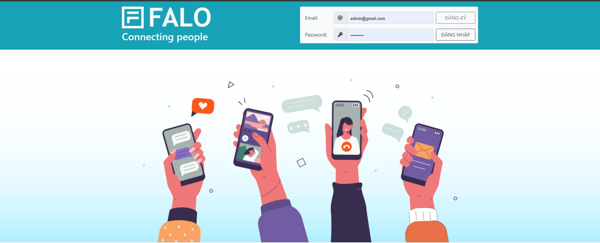
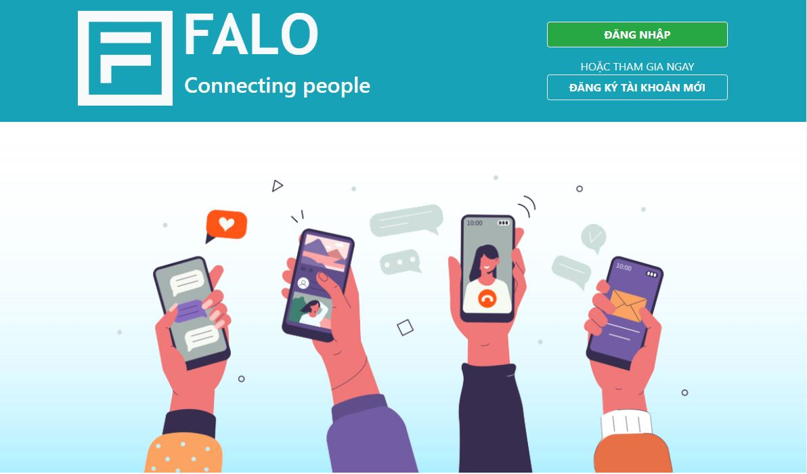
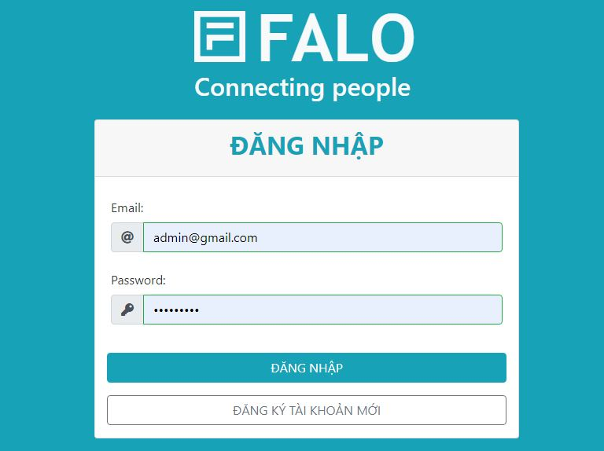
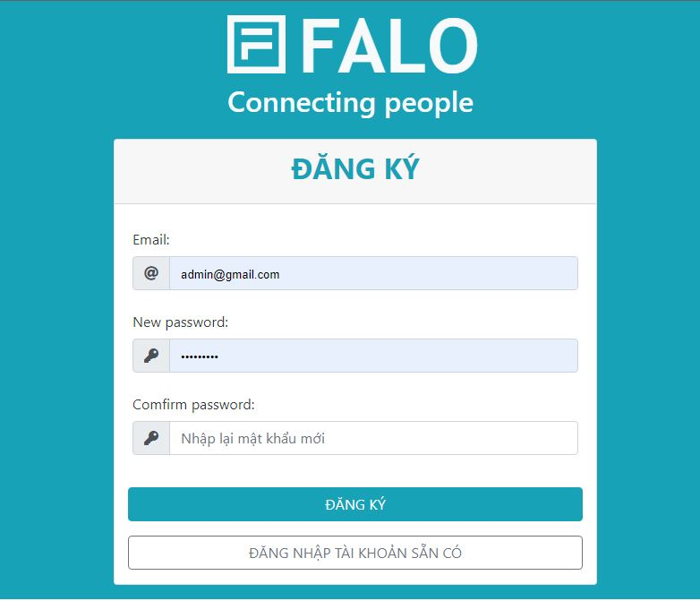
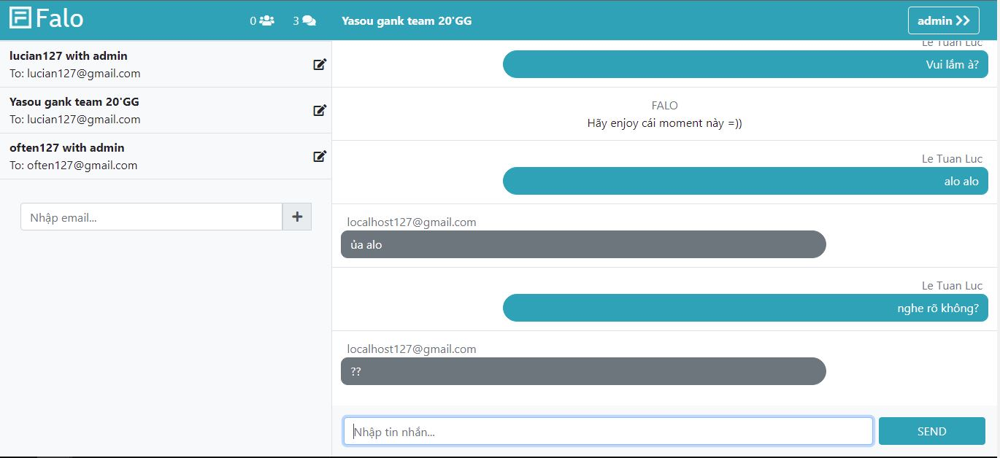

# NODEJS EXPRESS WEBCHAT PROJECT

## How to run:

```console
git clone https://github.com/often127/webchat.git
```

```console
cd falo
```

```console
npm start
```

Open your browser: localhost:3000


## Previews:

### Welcome:




### Sign in:


### Sign up:


### Chat home:


----------
Author:

### [Le Tuan Luc](https://github.com/often127)
#### [Lien Tan Vung](https://github.com/lientanvung) | [Nguyen Thanh An](https://github.com/An7112)